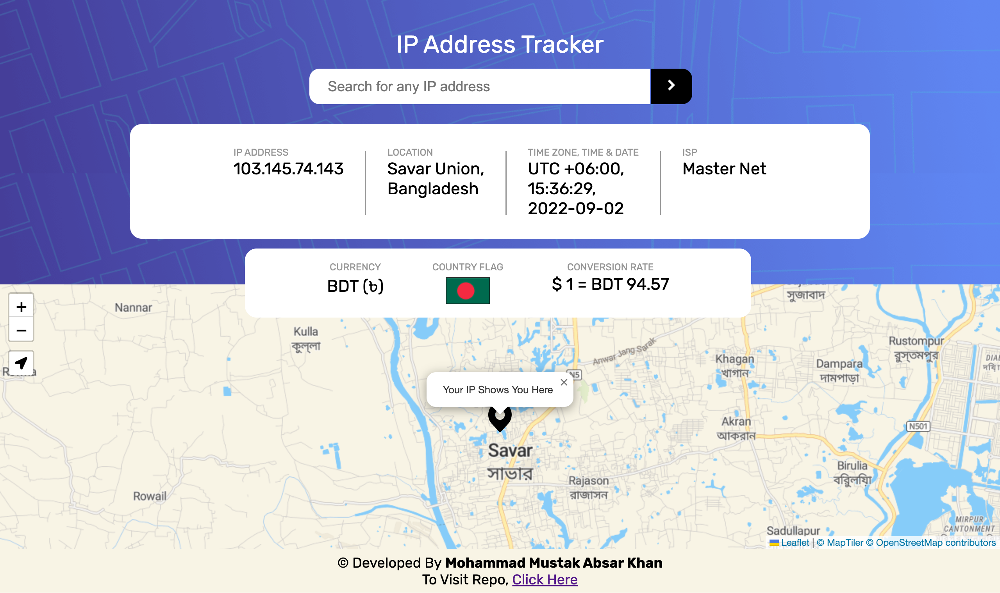

# ip-address-tracker

  

  
    
  
    

  

  <b>A real time IP Address Tracker and more</b>   
  Live Site URL - https://ip-address-tracker-live.netlify.app/  

### Screenshot
 

 

### Built with
- HTML, SASS(SCSS) & JS
- [IPGeoLocationAPI](https://ipgeolocation.io/)
- [ExchangeRateAPI](https://exchangerate.host/#/)
- [LeafletJS v1.8.0](https://leafletjs.com/)

### Features
**Disclaimer:The Location Detected Automatically Might Be Different From Your Actual Device Location**
- User's **Network IP Detection** on Load and IP Lookup Using Search Function
- **IPv4 & IPv6** Supported IP Locating Search Feature
- **Highly Accurate Device Location** Finding Feature on **THE MAP**
- **IP ADDRESS, LOCATION, TIME ZONE, TIME & DATE, ISP** Info Showing Feature
- **CURRENCY, COUNTRY FLAG & CONVERSION RATE(Latest)** Info Showing Feature
- **Error Catching** and **Automated Action** Taking Feature
